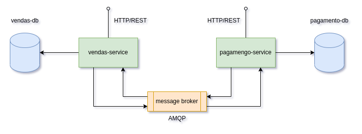
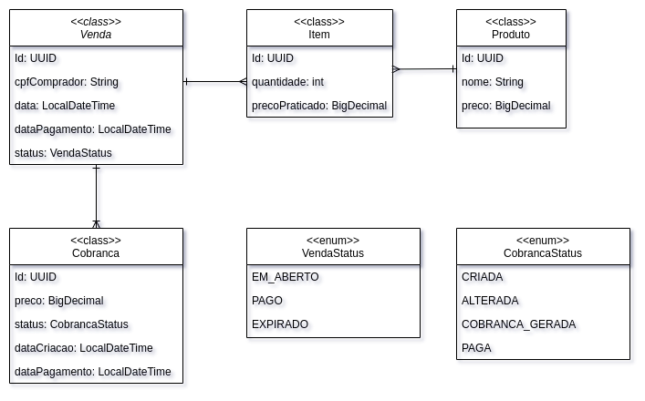
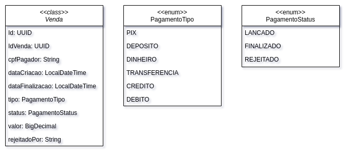

# Desafio Klok

- [Desafio Klok](#desafio-klok)
  - [Sobre o projeto](#sobre-o-projeto)
  - [Topologia](#topologia)
  - [APIs](#apis)
    - [Vendas Service](#vendas-service)
      - [Esquema](#esquema)
      - [Endpoints](#endpoints)
    - [Pagamento Service](#pagamento-service)
      - [Esquema](#esquema-1)
      - [Endpoints](#endpoints-1)
  - [Rodando Localmente](#rodando-localmente)
    - [Requisitos](#requisitos)
    - [Rodando](#rodando)
  - [Próximos desafios (Ou requisitos não contemplados)](#próximos-desafios-ou-requisitos-não-contemplados)

## Sobre o projeto

Este projeto foi desenvolvido como desafio no processo seletivo da KlokTech. Se trata da implementação de sistema simples de vendas e pagamentos. Como solução, foram implementadas duas APIs que oferencem interfaces HTTP (REST) e que se integram através do protocolo AMQP.

Para os serviços implementados, foram utilizados:
- Spring Boot para Configuração e Injeção de Dependências.
- Spring Web para construção de interface HTTP (Web Server).
- Spring JPA para integração com banco de dados Postgres.
- Flyway para versionamento de Banco de Dados.
- Spring AMQP para integração com o broker de mensageria RabbitMQ.
- Spring Validations para validação de campos de DTOs.

## Topologia

    
  
    

## APIs
### Vendas Service
#### Esquema

    
  
    

#### Endpoints
* [Listar Vendas](docs/vendas/pages/listar_vendas.md) : `GET /api/vendas/`
* [Buscar Venda](docs/vendas/pages/buscar_venda.md) : `GET /api/vendas/:id`
* [Cadastrar Venda](docs/vendas/pages/cadastrar_venda.md) : `POST /api/vendas/`
* [Adicionar Item na Venda](docs/vendas/pages/adicionar_item.md) : `POST /api/vendas/:idVenda/items/`
* [Alterar Quantidade de Item](docs/vendas/pages/alterar_quantidade.md) : `PATCH /api/vendas/:idVenda/itens/:idItem`
* [Apagar Venda](docs/vendas/pages/apagar_venda.md) : `GET /api/vendas/:id`
* [Buiscar Histórico de Cobranças](docs/vendas/pages/listar_cobrancas.md) : `GET /api/vendas/:id/cobrancas`
* [Listar Produtos](docs/vendas/pages/listar_produtos.md) : `GET /api/produtos`

### Pagamento Service
#### Esquema

    
  
    

#### Endpoints
* [Listar Pagamentos](docs/pagamento/pages/listar_pagamentos.md) : `GET /api/pagamentos/`
* [Buscar Pagamento](docs/pagamento/pages/buscar_pagamento.md) : `GET /api/pagamentos/:id`
* [Lancar Pagamento](docs/pagamento/pages/lancar_pagamento.md) : `POST /api/pagamentos/`

## Rodando Localmente
### Requisitos

- Docker ~> v20.10
- Docker Compose ~> v1.29

### Rodando

A partir da linha de comando:

  1. Clonar este repositório: `$ git clone git@github.com:AlineVNC/desafio-klok.git`
  2. Acessar diretório "infra" dentro da pasta do projeto: `$ cd desafio-klok/infra`
  3. Rodar receita de docker-compose contida no diretório: `$ docker-compose up`

- Vendas API estará exposta na porta: 8010.
- Pagamento API estará exposta na porta: 8020.
  
## Próximos desafios (Ou requisitos não contemplados)
- Autenticação por JWT
- Testes Unitários
- Api Gateway
